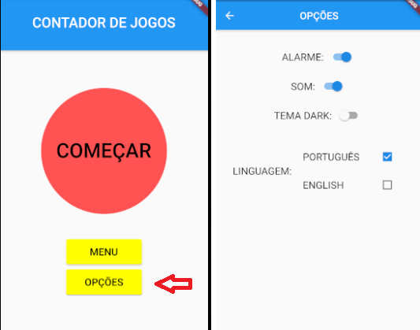
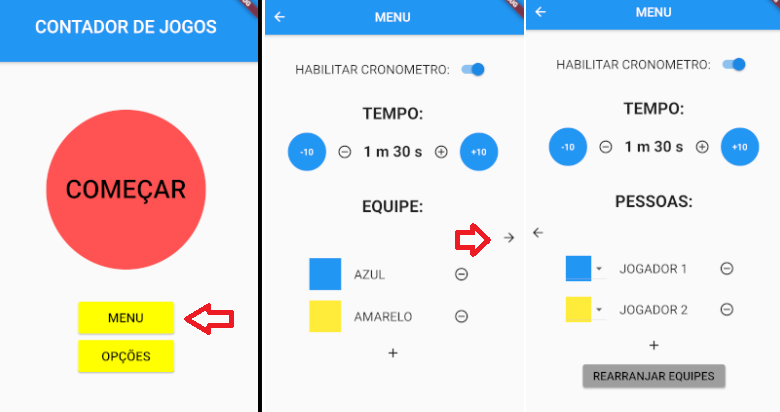
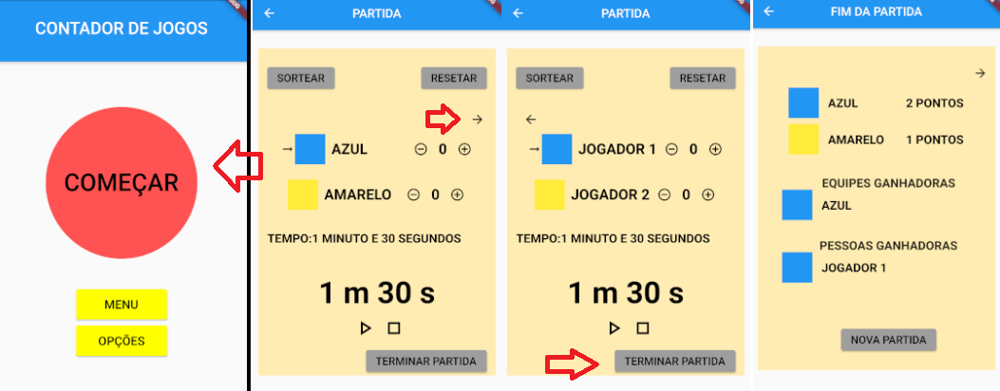

Utility for Games

An app with utilities to board or card games:
- Count the punctuation of each player or team. 
- Choose the team. 
- Timer.
- Roll a dice. (in construction)

Go to Options Page to choose the language, disable sound/alarm and choose the theme:

Go to Menu Page:

On this page, you can add more teams and players, associate each player to a team or to the neutral team (white). You can sort the players associated with the teams.
You can also disable or adjust the timer

Start the game:

Timer: You can initiate the timer, pause, restart. 
Points: You can add or sub-points to each player or team, you can reset the points and you can sort one team or one player (randomly to decide who is gonna start first, for example).

You can finalize the game and see who wins!
